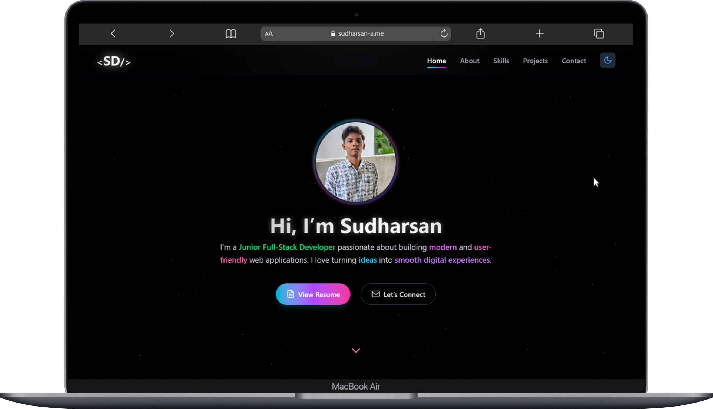
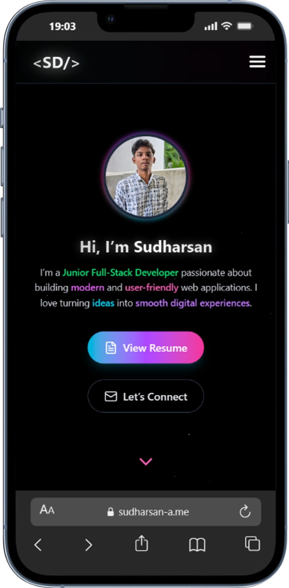
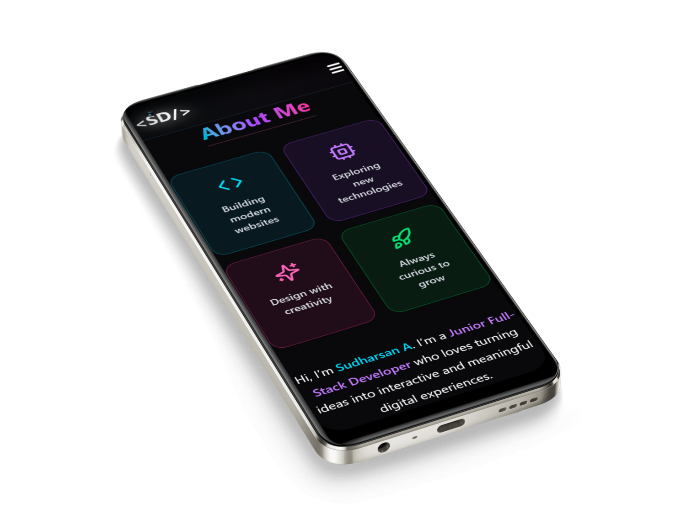

# Sudharsan A - Portfolio

A personal portfolio built to showcase my work, growth, and interest in crafting clean and purposeful digital experiences.

## Screenshots

<div align="center">

<!-- Desktop Screenshot -->


<br/><br/>

<!-- Mobile Screenshots Row -->
<div style="display: flex; gap: 30px; justify-content: center; align-items: center; flex-wrap: wrap;">
  
  
</div>

</div>

## Purpose

Built with intention - to document my work, track my progress, and connect with opportunities where technology and design meet practical value.

## Features

- _Responsive design_ optimized for all devices
- _Interactive 3D starfield background_ with smooth parallax motion
- _Smooth scroll navigation_ across all portfolio sections
- _Live contact form_ integrated for reliable message delivery
- _Dynamic theme support_ (Light/Dark mode)

## Tech Stack

- [React](https://reactjs.org/)
- [Tailwind CSS](https://tailwindcss.com/)
- [Framer Motion](https://www.framer.com/motion/)
- [React Three Fiber](https://r3f.docs.pmnd.rs/getting-started/introduction)

## Deployment

The application is deployed on Vercel. You can view the live version at: [Live Demo](https://sudharsan-a.vercel.app/)

## Installation

1. Clone the repository:

   ```bash
   git clone https://github.com/danielace1/sudharsan-a.git
   cd sudharsan-a
   ```

2. Install dependencies:
   ```bash
   npm install
   ```
3. Start the development server:
   ```bash
   npm run dev
   ```
4. Open your browser and navigate to `http://localhost:5173` to view the
   portfolio.

## Contributing

Contributions are welcome! Please feel free to submit a Pull Request.

- [Fork](https://github.com/danielace1/sudharsan-a/fork) the repository
- Create your feature branch (`git checkout -b feature/AmazingFeature`)
- Commit your changes (`git commit -m 'Add some AmazingFeature'`)
- Push to the branch (`git push origin feature/AmazingFeature`)
- Open a [Pull Request](https://github.com/danielace1/sudharsan-a/pulls)

## License

This project is licensed under the MIT License. See the [LICENSE](LICENSE) file for details.

## Author

- Website: [www.sudharsan-a.me](https://www.sudharsan-a.me)
- GitHub: [@danielace1](https://github.com/danielace1)
- LinkedIn: [Sudharsan A](https://www.linkedin.com/in/a-sudharsan/)

---

Made with ❤️ by Sudharsan A
